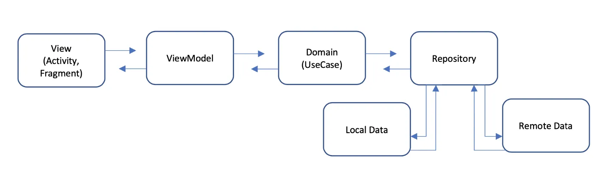

# Qui sont mes voisins ?

Dans ce TP, nous allons développer une application mobile permettant de gérer une liste de
personnes (voisins) en respectant le principe de clean architecture.

## Fonctionnalités principales

- Récupérer et afficher une liste de voisins
- Ajouter un voisin à la liste
- Supprimer un voisin de la liste
- Consulter le détail d'un voisin
- Ajouter un voisin à la liste de favoris
- Retirer un voisin de la liste de favoris
- Afficher les voisins favoris
- Partager le profil d'un voisin (via SMS, email, etc.)
- Consulter le profil d'un voisin sur un réseau social (Facebook, LinkedIn, etc.)

## Fonctionnalités secondaires

- Rechercher un voisin (par nom, phone, etc.)
- Trier les voisins (par nom, date de création, etc.)

## Mécanisme de stockage

- Dans la version V0 : Les voisins sont stockés en mémoire (pas de base de données)
- Dans une version V1 : Les voisins sont stockés dans une base de données (Room)
- Dans une version V2 : Les voisins sont stockés dans une base de données (Room) et sur Firebase
- Dans une version V3 : Les voisins sont stockés dans une base de données (Room) et sur un serveur (API REST)

## Architecture du code

L'application doit respecter le principe de clean architecture. Pour cela, nous allons organiser
notre code dans deux modules distincts :

- `app` : Contient le code spécifique à l'application (UI, logique liée à la vue, etc.)
- `data` : Contient le code métier de l'application (entités, services, repositories, etc.)

### Schéma d'architecture

- View/Activity/Fragment : Cette couche permet de générer l'interface graphique de l'application.
- ViewModel : Manipule les données utilisées dans les vues.
- LiveData : Permet de notifier les vues lorsque les données changent ou deviennent disponibles.
- UseCase : Cette couche gère la logique de récupération des données pour les vues. Les
  use cases sont utilisés pour récupérer les données dans les repositories et les transformer en
  modèles spécifiques aux vues.
- Repository : Composant médiateur permettant de récupérer les données dans les différentes sources.
- DataSource : Couche de traitement des données spécifiques à une source de données (API, base de
  données, etc.)

## Librairies utilisées
- ViewModel
- LiveData
- Navigation

## Votre travail
Implementer la version V0 de l'application en respectant les étapes suivantes :

### Étape 1 : Prise en main du projet

- Importez le projet dans Android Studio et lancez l'application. Vous avez déjà une base de code
  permettant de gérer la navigation et l'affichage des voisins.
- Il est probable que vous rencontriez des erreurs de compilation. Identifiez et corrigez-les.
- Ajouter une toolbar à l'activité principale.
- Remplacer les icons de la barre de navigation par des icons plus explicites. 
- Gérer au moins deux langues (français et anglais) pour les textes de l'application.

### Étape 2 : Optimiser la liste des voisins

- Complétez la vue liste en ajoutant d'autres données (photo, bio, icônes (likes, suppression, ...), etc.)
- Ajoutez un fragment pour afficher le détail d'un voisin.
- Supprimez un voisin de la liste (depuis la liste ou dans la vue de détail).

### Étape 3 : Gestion des favoris

- Ajoutez/supprimez un voisin en favoris (à partir de la liste ou dans la vue de détail).
- Affichez la liste des voisins favoris.

### Étape 4 : Créer de nouveaux voisins

- Ajoutez un fragment permettant de créer un voisin.

### Étape 5 : Partager le profil d'un voisin

- Partagez le profil d'un voisin (via SMS, email, etc.)
- Consultez le profil d'un voisin sur un réseau social (Facebook, LinkedIn, etc.)

### Étape 6 : Rechercher et trier les voisins

- Recherchez un voisin (par nom, phone, etc.)
- Triez la liste (par nom, date de création, etc.)

### Étape 7 : Injection de dépendances
Jusqu'ici nous avons utilisé des singleton pour récupérer les instances d'objects partagés. 
Dans cette étape, vous allez utiliser la librairie Dagger Hilt pour l'injection de dépendances.